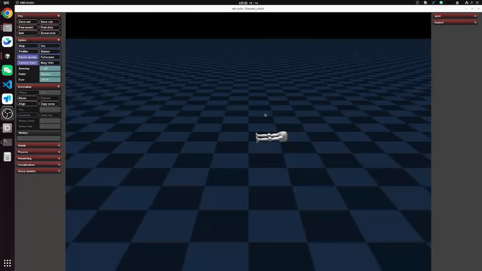
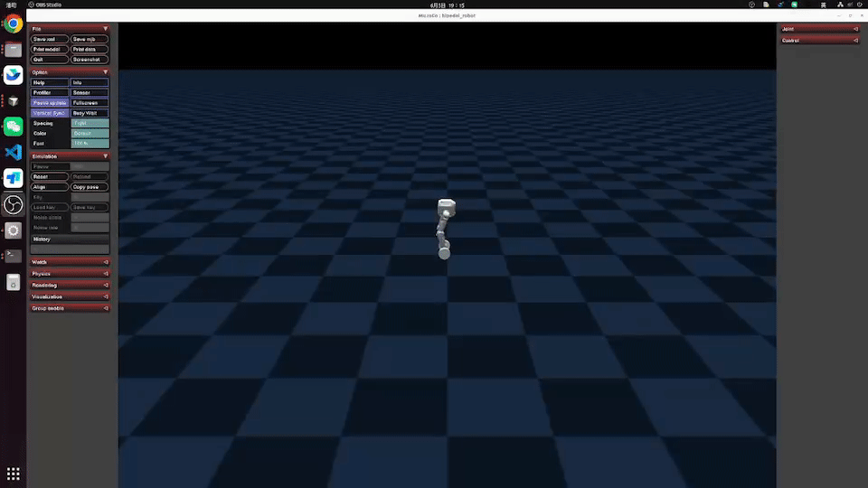
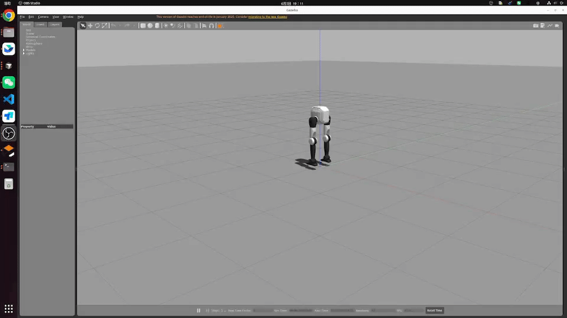
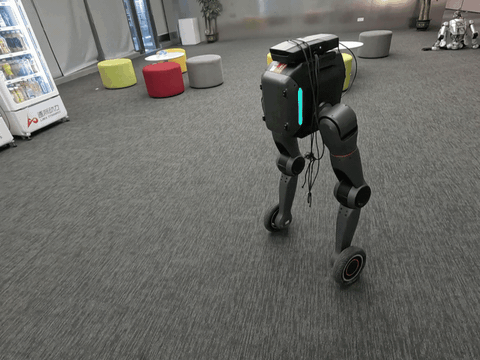
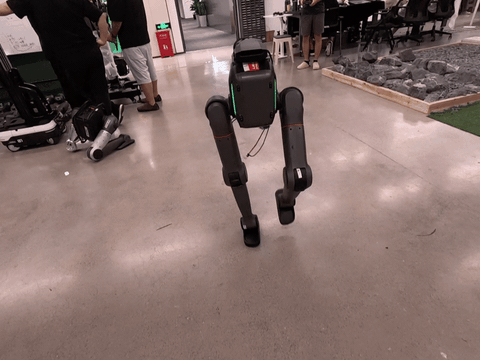

# English | [中文](README_zh-CN.md)

<!--
  SPDX-FileCopyrightText: 2024-2026 LimX Dynamics Technology Co., Ltd.
  SPDX-License-Identifier: Apache-2.0
-->

# tron2_rl_lab


> **Distribution:** the primary open-source copy of this repository is
> hosted at
> [`github.com/limx-tron2/tron2_rl_lab`](https://github.com/limx-tron2/tron2_rl_lab).

Reinforcement learning training stack for the LimX **TRON2A** bipedal
robot, built on top of
[Isaac Lab](https://isaac-sim.github.io/IsaacLab/) and using PPO to
train locomotion policies. This repository focuses on flat-terrain
training for the base morphology and supports both the **SF**
(sole-foot) and **WF** (wheel-foot) robot variants.

## License & attribution

This project is distributed under the **Apache License, Version 2.0**
(January 2004). The full text is in [`LICENSE`](LICENSE) at the root
of the repository. SPDX identifier: `Apache-2.0`.

- [`NOTICE`](NOTICE) — required attribution notice.
- [`THIRD_PARTY_NOTICES.md`](THIRD_PARTY_NOTICES.md) — per-component
  provenance: the Isaac Lab-derived extension, the vendored
  `rsl_rl/` fork (BSD-3-Clause), dev-tool license texts (including
  a GPL entry that must be classified before release), bundled
  STL / USD assets, and doc media.
- [`SECURITY.md`](SECURITY.md) — how to report a vulnerability or a
  safety-adjacent RL / reward / termination issue.
- [`CONTRIBUTING.md`](CONTRIBUTING.md) — dev setup, vendored-fork
  update policy, PR checklist, DCO sign-off.
- [`CHANGELOG.md`](CHANGELOG.md) — release notes and the currently
  outstanding **`⚠ TO CONFIRM`** items that block the first public
  tag.

Note on subtrees:

- `exts/bipedal_locomotion/setup.py` declares
  `license="Apache-2.0"`, aligned with the top-level LICENSE. The
  per-file Isaac-Lab-derivation audit is tracked separately as
  `⚠ TO CONFIRM` in `THIRD_PARTY_NOTICES.md` §1.
- `rsl_rl/` is a **vendored fork** of
  [`leggedrobotics/rsl_rl`](https://github.com/leggedrobotics/rsl_rl)
  under **BSD-3-Clause**; upstream copyright notices are retained
  (see `THIRD_PARTY_NOTICES.md` §2 and
  `CONTRIBUTING.md#vendored-rsl_rl-update-policy`).

For a summary of local modifications relative to upstream, see
[`CHANGES_VS_UPSTREAM.md`](CHANGES_VS_UPSTREAM.md) and
[`licenses/dependencies/README.md`](licenses/dependencies/README.md).

## Scope / not included

**Included** in this repository:

- Isaac Lab extension `exts/bipedal_locomotion/` with env / MDP /
  actuator / robot cfg for TRON2A.
- Vendored `rsl_rl/` PPO trainer and on-policy runner.
- Entry scripts `scripts/rsl_rl/{train,play}.py`, including ONNX /
  JIT policy export
  (`scripts/rsl_rl/play.py:108-118`).
- Bundled USD / STL assets for the `SF_TRON2A` and `WF_TRON2A`
  variants under
  `exts/bipedal_locomotion/bipedal_locomotion/assets/usd/`.
- Simulator playback GIFs under `doc/` (MuJoCo, Gazebo, real robot).

**Not included** — by design:

- **No trained policies** (`*.pt`, `*.pth`, `*.ckpt`, `*.onnx`,
  `*.jit`). Train them yourself, or fetch from LimX's internal
  artifact store / a GitHub Release.
- **No training logs, TensorBoard events, or Weights & Biases runs.**
  `logs/`, `wandb/`, `events.out.tfevents.*` are `.gitignore`'d and
  CI-blocked.
- **No automated test suite yet.** CI covers `python -m py_compile`,
  `ruff`, forbidden-artifact scans, and license scans. A manual
  headless training smoke test is documented and has been verified
  with the versions listed below.
- **No Isaac Sim redistribution.** You must obtain NVIDIA Isaac Sim
  5.1 independently and accept the NVIDIA proprietary EULA before
  installing this stack. Nothing here grants an Isaac Sim license.
- **No GPU / driver bundling.** A CUDA-capable GPU (≥ 12 GB VRAM
  recommended) is required to run 4096-env training. This repo does
  not ship drivers, CUDA, or PyTorch wheels.
- **No SDK binaries, firmware, calibration values, customer
  configuration, or vendor CAD.**

For deployment code (real-robot bring-up, ROS drivers, MuJoCo /
Gazebo integration), see the sibling repositories referenced in
[MuJoCo simulation and real-hardware deployment](#mujoco-simulation-and-real-hardware-deployment)
and
[Gazebo simulation and real-hardware deployment](#gazebo-simulation-and-real-hardware-deployment)
below.

## Repository layout

```
.
├── exts/bipedal_locomotion/   # Isaac Lab extension: env / asset / MDP / robot cfg
├── rsl_rl/                    # vendored rsl_rl fork (PPO + on-policy runner)
├── scripts/rsl_rl/            # training / play entry points (train.py / play.py / cli_args.py)
└── logs/                      # training logs and model weights
```

## Requirements

- **Isaac Sim 5.1.x** + **Isaac Lab 2.3.2**
- Python 3.11 (the Python version used by Isaac Sim 5.x)
- GPU (≥ 12 GB VRAM recommended for 4096-env training)

## Installation

```bash
# 0. Use the pre-provisioned environment (Isaac Sim / Isaac Lab are already installed).
conda activate tronlab

# 1. Clone the repository
git clone <repo-url> tron2_rl_lab
cd tron2_rl_lab

# 2. Editable install of the extension and the vendored rsl_rl.
#    Use the Python from the activated environment.
python -m pip install -e exts/bipedal_locomotion
python -m pip install -e rsl_rl

# 3. Optional developer tooling used by CI's lint check.
python -m pip install ruff
```

Do not install a second Isaac Sim or Isaac Lab copy into this environment.
The training and play scripts instantiate Isaac Sim through `AppLauncher`
before importing the extension; running `import bipedal_locomotion` directly
from a plain Python process can fail because the simulator's `pxr` modules
have not been initialized yet.
The pre-provisioned Isaac Sim / Isaac Lab environment has some known `pip check`
version conflicts between Isaac Sim kernel pins and optional Python tooling; do not
replace the simulator packages to resolve them.

## Training in Isaac Sim

Task IDs are registered in
[exts/bipedal_locomotion/bipedal_locomotion/tasks/locomotion/robots/__init__.py](exts/bipedal_locomotion/bipedal_locomotion/tasks/locomotion/robots/__init__.py).

### 1. Training a model

```bash
# === Solefoot (SF) ===
python scripts/rsl_rl/train.py --task Isaac-Limx-SF-TRON2A-Blind-Flat-v0 --num_envs 4096 --headless

# === Wheelfoot (WF) ===
python scripts/rsl_rl/train.py --task Isaac-Limx-WF-TRON2A-Blind-Flat-v0 --num_envs 4096 --headless
```

*Common options:*
- `--checkpoint_path <path>`: resume from a specific `.pt` checkpoint.
- `--video`: enable video recording.
- `--max_iterations N`: override the maximum number of iterations.

Log path: `logs/rsl_rl/<experiment_name>/<timestamp>_<run_name>/`

### 2. Running inference (play)

Use the task ID with the `-Play-v0` suffix. The play cfg uses fewer
envs, disables domain randomization, and simplifies the terrain.

```bash
# Solefoot (SF)
python scripts/rsl_rl/play.py --task Isaac-Limx-SF-TRON2A-Blind-Flat-Play-v0 --num_envs 32

# Wheelfoot (WF)
python scripts/rsl_rl/play.py --task Isaac-Limx-WF-TRON2A-Blind-Flat-Play-v0 --num_envs 32
```

*Note:* by default the latest checkpoint is loaded; pass
`--checkpoint_path` to select a specific one.

### 3. Resuming a training run

`--resume True` must be passed explicitly for a checkpoint to be
loaded.

```bash
# Option A: point directly at a .pt file (recommended)
python scripts/rsl_rl/train.py --task Isaac-Limx-SF-TRON2A-Blind-Flat-v0 --resume True --checkpoint_path <path_to_model>

# Option B: look up a run by name
python scripts/rsl_rl/train.py --task Isaac-Limx-SF-TRON2A-Blind-Flat-v0 --resume True --load_run <run_name>
```

## Robot morphology

| Morphology | End-effector | task id prefix |
|---|---|---|
| SF_TRON2A | sole foot (ankle pitch) | `Isaac-Limx-SF-TRON2A-...` |
| WF_TRON2A | wheel | `Isaac-Limx-WF-TRON2A-...` |

## Architecture overview

The project is organized into three main parts:

1. **`exts/bipedal_locomotion/`** — Isaac Lab extension. Contains
   env / asset / MDP / robot cfg.
2. **`rsl_rl/`** — vendored fork. `scripts/rsl_rl/train.py` prefers
   the algorithm library from this path.
3. **`scripts/rsl_rl/`** — entry-point scripts for training and
   inference.

### Task wiring flow

Taking `Isaac-Limx-SF-TRON2A-Blind-Flat-v0` as an example:

1. **Gym registration**: in `tasks/locomotion/robots/__init__.py`,
   the environment configuration and PPO configuration are bound to
   the task ID.
2. **Env cfg**: `tasks/locomotion/robots/limx_solefoot_tron2a_env_cfg.py`
   defines asset loading and MDP rules.
3. **Asset cfg**: `assets/config/solefoot_tron2a_cfg.py` specifies
   the built-in USD path and actuator parameters.

## MuJoCo simulation and real-hardware deployment

- [MuJoCo simulation repository](https://github.com/example/tron1-mujoco-sim)
- [Python real-hardware deployment code](https://github.com/example/tron1-deploy-python)

### MuJoCo deployment result (SF / WF)

<p align="center">
  
  
</p>

- If the previews above do not render, download them directly:
  - [mujoco_sf.gif](doc/mujoco_sf.gif)
  - [mujoco_wf.gif](doc/mujoco_wf.gif)

## Gazebo simulation and real-hardware deployment

- [Gazebo simulation repository](https://github.com/example/tron1-gazebo-sim)
- [ROS real-hardware deployment code](https://github.com/example/tron1-deploy-cpp)

### Gazebo deployment result (SF / WF)

<p align="center">
  
  
</p>

- If the previews above do not render, download them directly:
  - [gazebo_sf.gif](doc/gazebo_sf.gif)
  - [gazebo_wf.gif](doc/gazebo_wf.gif)

## Real-hardware deployment results (office scene)

<p align="center">
  
  
</p>

## Real-hardware operating notes (strongly recommended)

Follow this fixed start-up and landing sequence to avoid impact
transients when switching policies:

1. **Suspend the robot** so that neither foot is loaded; check joint
   state, e-stop, and communication.
2. **Enter IK mode first** and confirm inverse-kinematics control is
   stable and the pose matches what you commanded.
3. **Slowly lower the robot to the ground**, watching for smooth
   contact and any abnormal shaking.
4. **Only then switch to the walk policy**, verifying at low speed
   and small stride before ramping up.

If anything abnormal happens (sudden shaking, pose divergence, hard
impact on landing), trigger the emergency stop immediately, return
to the suspended state, and re-check.

## Verification

The commands below match what CI runs (see
[`.github/workflows/ci.yml`](.github/workflows/ci.yml)); running them
locally before opening a PR saves review round-trips.

```bash
# 1. Byte-compile every first-party Python file.
python -m py_compile $(git ls-files '*.py')

# 2. Lint (first-party subtrees; the vendored rsl_rl fork is not
#    style-gated).
python -m pip install ruff
ruff check --select F exts scripts
# The current tree reports pre-existing F findings under ruff 0.16.3; these are
# diagnostic and are separate from the successful Isaac Sim smoke run.

# 3. Editable-install dry run. Isaac Sim / Isaac Lab are not on
#    PyPI, so the transitive resolution may fail; the goal is to
#    validate setup.py / pyproject.toml metadata.
python -m pip install --dry-run -e exts/bipedal_locomotion
python -m pip install --dry-run -e rsl_rl

# 4. Ensure no training artifacts / SDK binaries are staged.
git ls-files | grep -iE \
  '(^|/)logs/|(^|/)wandb/|\.pt$|\.pth$|\.ckpt$|\.onnx$|events\.out\.tfevents\.' \
  && echo "!! training artifacts staged" && exit 1 || echo "ok"
```

With Isaac Sim 5.1.x / Isaac Lab 2.3.2 installed, the short end-to-end
smoke run below initializes Isaac Sim headlessly, creates 16 SF
environments, and completes two training iterations:

```bash
conda activate tronlab
python scripts/rsl_rl/train.py --task Isaac-Limx-SF-TRON2A-Blind-Flat-v0 \
  --num_envs 16 --headless --max_iterations 2
```

The run writes checkpoints under `logs/rsl_rl/`; this directory is ignored by
Git and must not be committed.

## Reference

- [Isaac Lab](https://github.com/isaac-sim/IsaacLab)
- [RSL-RL](https://github.com/leggedrobotics/rsl_rl) — upstream of
  the vendored fork under [`rsl_rl/`](rsl_rl).

## Cite & support

If you use this training stack in academic or public work, please
cite the repository:

```
@misc{limx_tron2_rl_lab_2026,
  title  = {tron2_rl_lab: RL training stack for the LimX TRON2A bipedal robot},
  author = {LimX Dynamics},
  year   = {2026},
  howpublished = {\url{https://github.com/limx-tron2/tron2_rl_lab}}
}
```

- **Bug reports / feature requests:** [GitHub Issues](https://github.com/limx-tron2/tron2_rl_lab/issues).
- **Questions / integration help:** [GitHub Discussions](https://github.com/limx-tron2/tron2_rl_lab/discussions).
- **Security reports:** email `contact@limxdynamics.com`; see
  [`SECURITY.md`](SECURITY.md).
- **Hardware / real-robot safety incidents:** email
  `contact@limxdynamics.com` with subject prefix
  `[tron2_rl_lab hardware]`. Do not open a public issue.
- **Company / commercial contact:** <https://www.limxdynamics.com>.
